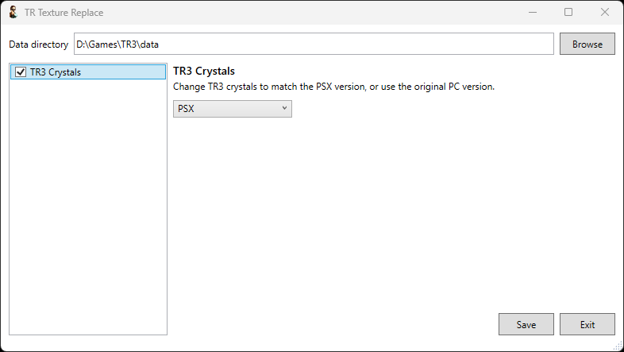

# TR Texture Replacer

_A simple tool to apply specific texture modifications to classic Tomb Raider levels._

## Prerequisites
* [.NET Core 6.0](https://dotnet.microsoft.com/en-us/download/dotnet/6.0)

## Usage
1. Download the latest release from https://github.com/lahm86/TRTextureReplace/releases/latest. You can choose the 32-bit (x86) or 64-bit (x64) version to best match your setup.
2. Place the TRTextureReplace.exe file in the same directory as your Tomb Raider installation.
3. Launch TRTextureReplace.exe.
4. Verify that the Data directory is correct i.e. that it points to the folder where your level files are stored.
5. Select your chosen texture mods and their individual options.
6. Click Save.

## Thanks
Thank you to:

* Trxyebeep, for guidance on requirements, and testing.
* DanzaG, for the TRLevelReader library - part of [TRRando](https://github.com/DanzaG/TR2-Rando).
